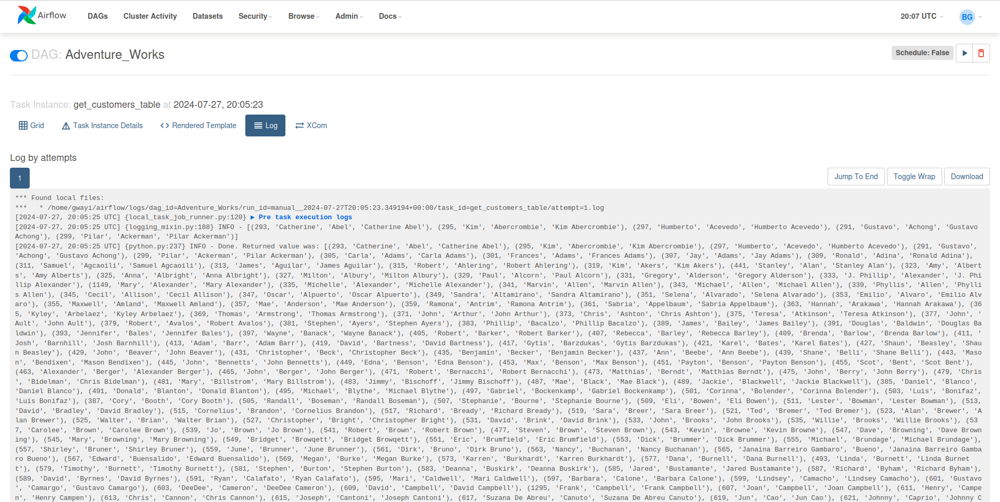

Apache Airflow® is an open-source platform for developing, scheduling, and monitoring batch-oriented workflows. Airflow’s extensible Python framework enables you to build workflows connecting with virtually any technology. A web interface helps manage the state of your workflows. Airflow is deployable in many ways, varying from a single process on your laptop to a distributed setup to support even the biggest workflows.  
Tech Stack: PostgreSQL Database, Python, Apache Airflow, AWS

### Source [PostgreSQL Database]


### Instatiate a DAG
```
default_args={
  ‘Owner’ : ‘gwayi’
  'retires' : 2,
  'retry_delay': 3,
  }

@dag(
dag_id=”jobs_listing”, # unique identifier
default_args=default_args, # default arguments
schedule=@daily, # how often the dag runs
start_date=datetime(2024, 7, 20), # start date for the dag
catchup=False, # run/not run missed intervals
tags=['Team A'], # to categorize and filter dags in UI
)
```
### Defining Tasks
*Get Customers*
```
@task()
def get_customers():

# Establishing connection - postgreSQL[Source]
conn = psycopg2.connect(database = "adventure_works", 
                        user = "postgres", 
                        host= 'localhost',
                        password = "p@ssword",
                        port = 5432)
cursor = conn.cursor()

## Print PostgreSQL details
print("PostgreSQL server information")
print(conn.get_dsn_parameters(), "\n")

# Execute SQL Statement
cursor.execute("""SELECT * FROM customer;""")
rows = cursor.fetchall()
conn.commit()
conn.close()

customers = []
for row in rows:
    customers.append(row)
print(customers[:5])
return customers
```


*Get Products*
```
@task()
def get_products():
conn = psycopg2.connect(database = "adventure_works", 
                        user = "postgres", 
                        host= 'localhost',
                        password = "p@ssword",
                        port = 5432)
product_df = pd.read_sql("SELECT * FROM products", conn)

```
[.pycode ETL code](etl.py)

# Running the DAG
```
airflow webserver -p 8080
airflow scheduler
```
